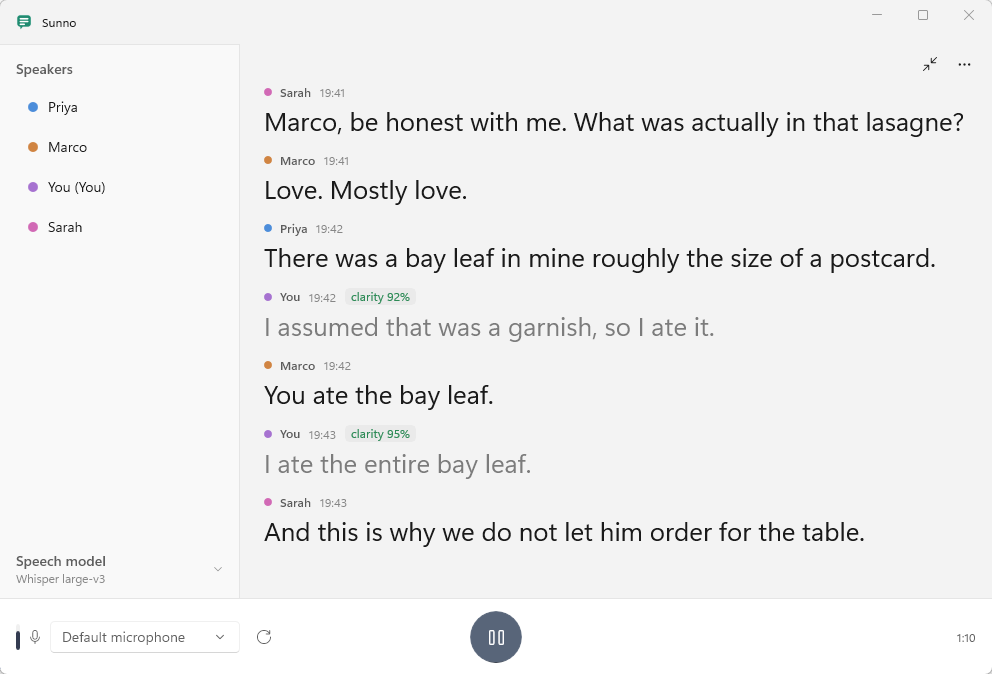
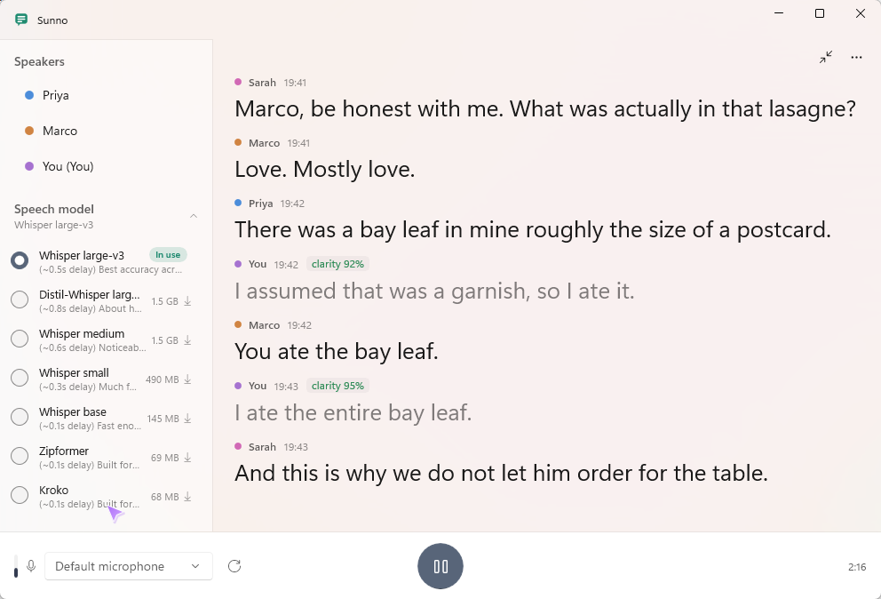

# Sunno

**Live captions for the conversation in front of you, running entirely on your own PC.**



---

## Why this exists

I kept missing things.

Not the big things. I hear those. It is the small ones that go past: the end of a sentence when
someone turns their head, the name of the restaurant, the punchline everyone else laughs at. You
nod along and hope nobody asks a follow up question. If you have done that, you already know why
this app exists.

Sunno means "listen" in Hindi and Urdu.

## What it does

Point it at a microphone and it writes down what people are saying, as they say it. Put it near
the table at dinner, beside you in a meeting, or pass a small mic to whoever is talking.

- **Fast enough to follow a conversation.** Around a third of a second behind on a machine with
  an NVIDIA GPU, so you are reading along rather than reading a transcript of something that
  already ended.
- **Labels who is speaking.** A four way conversation reads like a conversation instead of one
  long paragraph. Rename anyone, and mark which one is you so your own lines step back.
- **Captions your PC's audio too,** which covers video calls, YouTube, podcasts, anything coming
  out of your speakers.
- **Handles accented speech well.** This was the whole reason for choosing Whisper large-v3 over
  faster alternatives. See [the engineering notes](docs/ENGINEERING.md#why-these-choices).
- **Shrinks to a strip** when you only want the words, and stays on top of whatever you are
  reading.
- **Runs without a graphics card.** Alongside the Whisper models there are two streaming ones,
  Zipformer and Kroko, built for machines with no GPU. Both are under 70 MB and stay about a
  tenth of a second behind.
- Adjustable text size, always on top, and you can select and copy any part of the transcript.

<table>
<tr>
<td width="50%"></td>
<td width="50%"></td>
</tr>
<tr>
<td>Compact mode, for when you want the words and nothing else.</td>
<td>Pick a model. Each one shows its size and how far behind it will run on your PC.</td>
</tr>
</table>

## It runs on your PC. All of it.

This matters more than any feature.

Captioning apps usually stream your microphone to a company's servers. That means the
conversation at your dinner table, with your family in it, leaves your house. People who have not
thought about it will still feel it, and they are right to.

Sunno does the recognition on your own machine. No account, no sign in, no telemetry, no server
to send anything to. Turn off your Wi-Fi and it works exactly the same. The people around you are
not being uploaded anywhere, and you can tell them so honestly.

The only time Sunno touches the network is downloading the speech model on first run. After
that, never.

Full details in [PRIVACY.md](PRIVACY.md), including the one thing that does get written to disk:
if you pin a speaker so Sunno recognises them next time, their name and voice fingerprint are
saved locally.

## Install

**From the Microsoft Store:** coming soon.

**From source:** see [Building](#building) below.

On first run Sunno downloads a speech model. Whisper large-v3 is roughly 3 GB; the streaming
models are under 70 MB. Either way it needs an internet connection for that one step only.
It runs on any modern PC: with an NVIDIA GPU captions appear almost
immediately, and without one you can either use your processor with a Whisper model, which works
but lags further behind, or pick one of the streaming models built for exactly that case.
The app measures your machine and tells you what to expect before you commit to a download.

## Building

Requires .NET 8, the Windows App SDK, and Python 3.12 from python.org. Not the Microsoft Store
Python build, which is sandboxed and unreliable at loading native CUDA DLLs.

```powershell
winget install --id Python.Python.3.12 --scope user
& "$env:LOCALAPPDATA\Programs\Python\Python312\python.exe" -m venv .venv
.\.venv\Scripts\python.exe -m pip install -r requirements.txt
```

Run the backend on its own, useful for testing without the desktop app:

```powershell
.\.venv\Scripts\python.exe -m server.app --list-devices
.\.venv\Scripts\python.exe -m server.app --device "Umik-1"
```

Build the installable package:

```powershell
.\packaging\build-msix.ps1
```

Tests are standalone scripts rather than pytest:

```powershell
.\.venv\Scripts\python.exe tests\test_biquad.py
.\.venv\Scripts\python.exe tests\test_hallucinations.py
```

## Honest about what it cannot do

No captioning system is perfect, and anyone who tells you otherwise is selling something.

- **Microphone placement matters more than the model.** Moving from a distant tabletop mic to a
  close talking one is worth roughly twice the accuracy, which is more than any model change
  available. There is a table of measured numbers in
  [the engineering notes](docs/ENGINEERING.md#microphone-matters-more-than-the-model).
- **Speaker labels are best effort.** Around two thirds of turns are correct on two speaker
  audio. Short turns like "yeah" or "okay, fine" are left unlabelled rather than guessed at,
  because embeddings need two to three seconds of speech to be dependable. Naming the people you
  talk to most is the single biggest improvement.
- **Overlapping speech degrades badly.** When two people talk at once, single channel
  recognition of any kind struggles. Separation models fast enough for real time are not
  practical yet on this hardware.
- **Across a noisy room it will drop words.**

It is a tool for catching more of what is said, not a court transcript. Used that way, it is
genuinely useful.

## How it fits together

```
microphone ──► resample 16 kHz ──► Silero VAD ──► Whisper large-v3 ──► WebSocket ──► WinUI app
                                                   (CUDA, or CPU)
```

A Python backend does capture and recognition. A WinUI 3 desktop app displays the results and
talks to it over a local WebSocket. They are separate processes on purpose, so the display could
later move to a handheld screen while this PC keeps doing the work.

| Directory | Contents |
|---|---|
| `server/` | Python backend: capture, VAD, recognition, speaker labelling |
| `app/` | WinUI 3 desktop app |
| `ui/` | Browser client, for the phone or handheld route |
| `packaging/` | Icon generation, CUDA trimming, MSIX build |
| `docs/ENGINEERING.md` | Why each decision was made, with the measurements behind it |

## Licence

MIT. See [LICENSE](LICENSE) and [THIRD-PARTY-NOTICES.md](THIRD-PARTY-NOTICES.md).

Sunno is free, and the source is public so you can read exactly what it does with your
microphone rather than taking my word for it. If you find something that contradicts
[PRIVACY.md](PRIVACY.md), that is a bug and I want to know about it.
